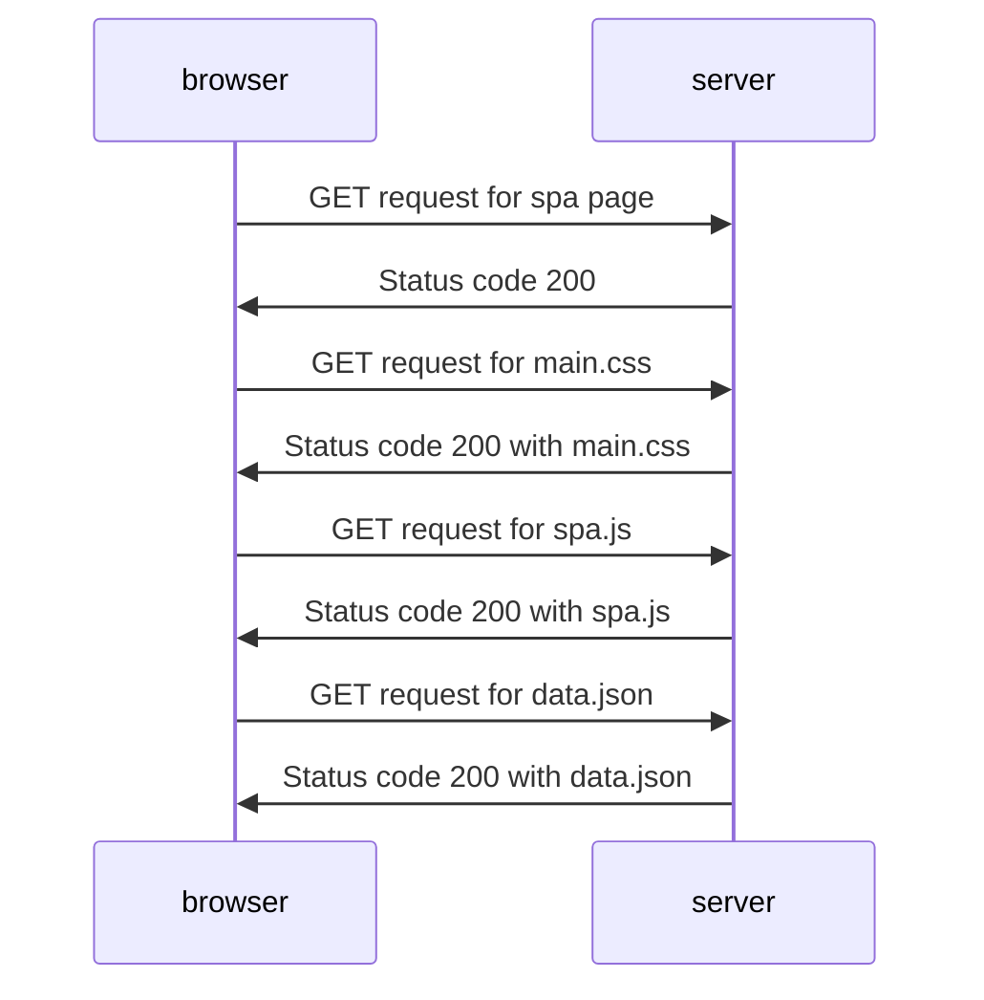

```mermaid
    sequenceDiagram
    browser->>server: GET request for spa page;
    server->>browser: Status code 200;
    browser->>server: GET request for main.css;
    server->>browser: Status code 200 with main.css;
    browser->>server: GET request for spa.js;
    server->>browser: Status code 200 with spa.js;
    browser->>server: GET request for data.json;
    server->>browser: Status code 200 with data.json;
```